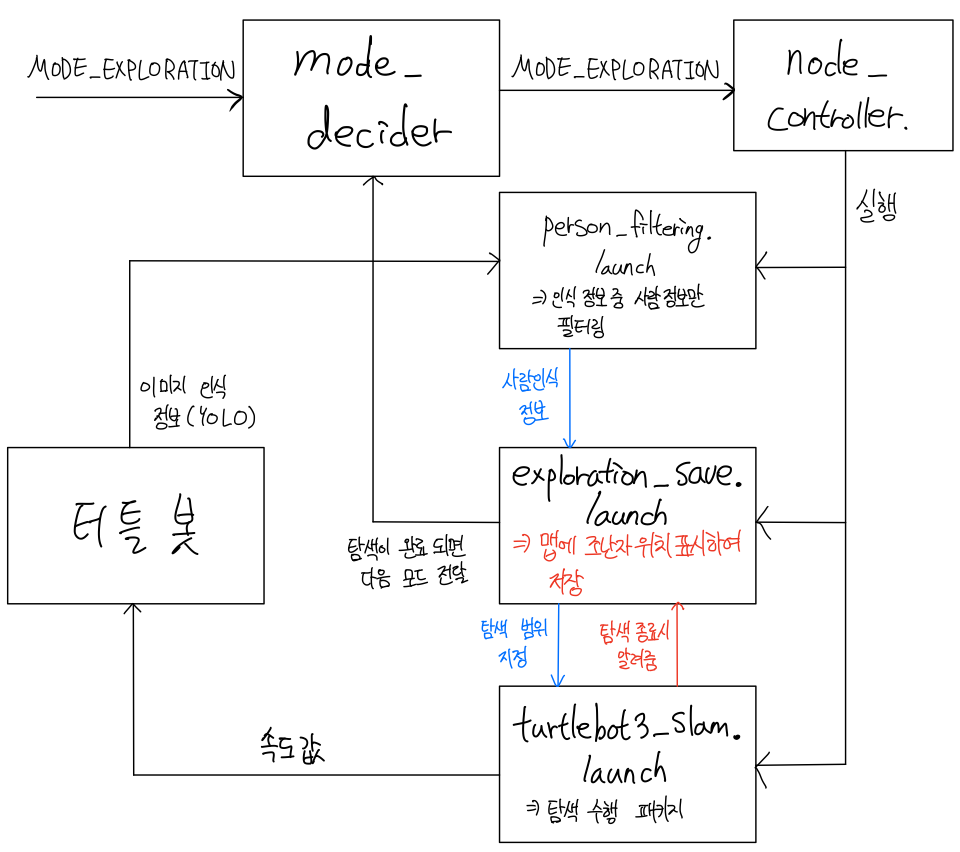

# kesla_project ( 지속 업데이트 중입니다. )
[2020.03~] 졸업프로젝트 - 붕괴 위기가 있는 건물에서의 조난자 탐색 로봇

## Team. kesla
◎ AI

★정원석

★김정환
 
◎ Embedded System

★권세진

★장성광

# 0. index

1. [summary](https://github.com/0307kwon/kesla_project#1-summary)

2. [상황 설정](https://github.com/0307kwon/kesla_project#2-%EC%83%81%ED%99%A9-%EC%84%A4%EC%A0%95)

3. [하드웨어 setting](https://github.com/0307kwon/kesla_project#3-%ED%95%98%EB%93%9C%EC%9B%A8%EC%96%B4-setting)

4. [Code 구조](https://github.com/0307kwon/kesla_project#4-code-%EA%B5%AC%EC%A1%B0)

5. [Code](https://github.com/0307kwon/kesla_project#5-code)

6. [진행 상황](https://github.com/0307kwon/kesla_project#6-%EC%A7%84%ED%96%89-%EC%83%81%ED%99%A9)

# 1. summary


▲ 4개의 방을 모두 둘러보는 터틀봇 [2020-11-08]

붕괴 위기가 있는 건물에서 사람이 직접 들어가는 것은 위험부담이 매우 크다.


이를 해결하기 위해 사람을 인식할 수 있는 로봇을 대신 진입시켜


건물 내를 꼼꼼히 탐색하고 조난자가 있는 위치를 맵에 표시하여


인명 구조 작업을 위한 정보 습득을 위해 사용한다.


# 2. 상황 설정
1. lane tracking : 도로가 건물까지 이어져 있고 터틀봇은 도로를 따라 건물까지 도달한다.


2. exploration : 건물에 진입해 건물의 map 정보를 모두 얻을 수 있을 때까지 탐색한다.


3. recognition : 사람을 인식해 map에 표시한다.


4. navigation : 2~3 과정이 모두 끝나면 건물을 탈출한다.


# 3. 하드웨어 setting
* 로봇 : turtlebot3 burger


  * computing resource : nvidia jetson nano (터틀봇에 장착)
  
  
  * camera : 라즈베리파이용 webcam
  
  
* commander 


  * computing resource : notebook
  
  
  
# 4. Code 구조 
현재 필요한 mode를 받아와 해당 mode에 맞는 프로그램(Ros 패키지)을 실행시킵니다.
  


## mode에 해당하는 ros 실행 패키지들 ( 계속 업데이트 됩니다. )


* MODE_NONE : 아무런 동작을 하지 않습니다.


* MODE_TRAFFIC_SIGN : 도로를 따라가는 모드
  <p></p>
  <details>
  <summary> traffic_robot_control/control.launch - by 장성광,정원석,김정환,권세진 </summary>
 
  </details>
  
  <p></p>
  <details>
  <summary> opencv/opencv.launch - by 정원석 </summary>
 
  1. 카메라로부터 이미지를 받아온다
  2. 이미지중 밑 부분만 잘라 사용 (차선이 잘 보이는)
  3. 노란색만 인식
     1. 이미지를 hsv로 컬러 변경
     2. 노란색 영역만 표시( (20, 100, 10), (30, 255, 255) )
  4. 노란색만 인식된 이미지를 cv2.threshold, cv2.GaussianBlur, cv2.Canny를 통해 가공
  5. cv2.HoughLinesP를 사용하여 파라미터 조정을 통해 차선 정보를 받아온다
  6. 왼쪽 오른쪽 선을 구분하고 기울기를 받아와 차선 정보를 controller.launch로 넘겨준다
  </details>
  
  
    
* MODE_EXPLORATION : 건물 탐색 모드

  <p></p>
  <details>
  <summary> turtlebot3_slam/turtlebot3_slam.launch - <a href="https://github.com/ROBOTIS-GIT/turtlebot3">라이브러리</a> </summary>
 
  </details>
  
  <p></p>
  <details>
  <summary> exploration_save/exploration_save.launch - by 권세진, 장성광 </summary>
 
  </details>
  
  
  
* MODE_MAP_SAVE : 건물 탐색이 모두 끝나고 생성된 맵을 savemap.yaml 파일로 저장하는 모드입니다.

  <p></p>
  <details>
  <summary> map_server/map_saver.launch - [라이브러리](http://wiki.ros.org/map_server) </summary>
 
  </details>
  
* MODE_NAVIGATION : 건물 탈출 모드

  <p></p>
  <details>
  <summary> nav_control/nav_control.launch - by 권세진 </summary>
 
  </details>

 
# 5. Code 
## 1. [mode_decider.cpp](./mode_decider/src/mode_decider.cpp) - by 장성광, 권세진
들어온 모드 메세지를 확인하고 해당 모드로 바꿔도 문제가 없을 시 모드를 갱신합니다.

(현재는 모드 메세지가 들어오면 해당 모드로 바로 변경합니다.)

## 2. [node_controller.cpp](./node_controller/src/node_controller.cpp) - by 장성광, 권세진
바뀐 모드가 필요로 하는 ros 패키지들을 실행시킵니다. launch 파일을 실행시키는 것이 원칙입니다.


### 2-1 [cpp_roslaunch.cpp](./node_controller/src/cpp_roslaunch.cpp) - by 권세진
코드로 roslaunch 명령을 실행하는 소스입니다.
```txt
   핵심 함수 설명
   1. void cpp_roslaunch::init()
         cpp_roslaunch.cpp에 의해 실행된 모든 ros 패키지를 강제 종료시킵니다.
   2. int cpp_roslaunch::kill_node(const char* node_name)
         실행중인 패키지 중에 (node_name) 이름을 가진 패키지를 강제 종료합니다.
   3. int cpp_roslaunch::roslaunch(const char* node_name,const char* launch_name)
         (node_name) 이라는 패키지의 (launch_name) 파일을 roslaunch로 실행시킵니다.
   4. void cpp_roslaunch::mychild(int sig)
       예기치않게 종료되지 않고 남아있는 패키지들을 제거합니다.
 ```
# 6. 진행 상황

<details>
<summary>[2020-11-08] 건물의 방을 모두 exploration</summary>
       


</details>


